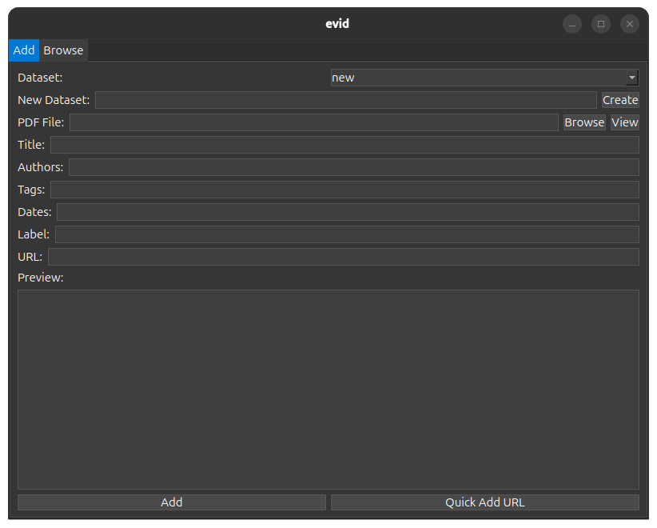
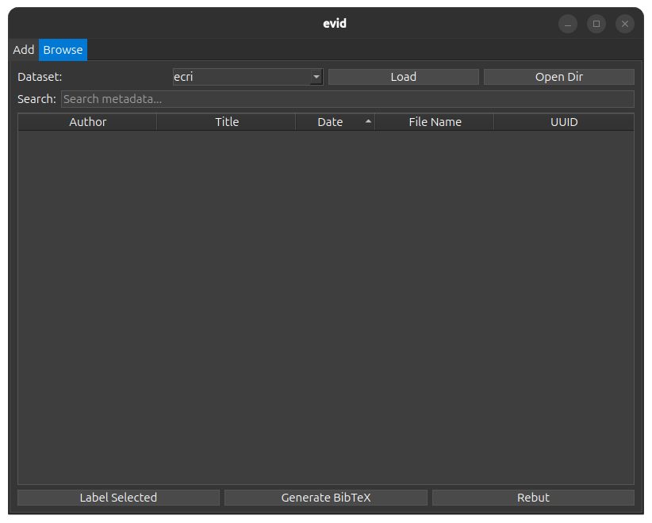
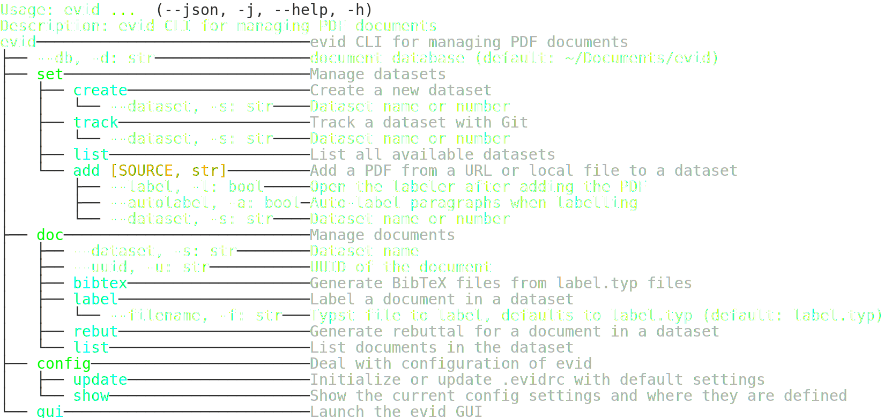

# evid - PDF Labeler
`evid` is an application, aimed at the legal industry, for labelling PDF text content and making the labels citeable (for use in e.g.  or Typst). 

## Workflow
- Create a dataset
- Add PDFs
- Label the text, extracted from the PDF, using a text editor, surrounding labelled text with `#lab(key,text,note)` in typst
- Use `generate bibtex` to create a BibTeX file, this will use `typst query` in the background. 
- Use `rebut` to create a line-by-line rebuttal, that can be used in an LLM (the remarks are line prompts for the LLM).  

## Installation
To install the latest version of `evid`:
```bash
uv pip install https://github.com/evidlabel/evid.git
```

## Usage

### GUI
Launch the GUI using:
```bash
evid 
```
Which gives access to a two-pane app, one for adding files, and one for browsing datasets. 



### CLI

Use the CLI to manage datasets:



## Documentation 

For more detailed information, visit the [documentation page](https://evidlabel.github.io/evid/).

## Labelling
- When selecting a document and pressing the "Label" button, a typst document is generated that contains the extracted text from the PDF. 
    
    The typst document is saved in the same folder as the PDF. 

- The user can now label using their text editor inside the typst document. For VS Code, the following keybinding will allow labelling by selecting text and pressing `ctrl+l`:
    ```json 
    {
        "key": "ctrl+L",
        "command": "editor.action.insertSnippet",
        "when": "editorTextFocus && editorLangId == 'typst'",
        "args": {"snippet": "#lab(\"$1\",\"${TM_SELECTED_TEXT}\",\"$2\")"}
    }
    ```
    The first field is the label attached (generally a short descriptive string), the second field is the text that was highlighted, and the third field is a comment about the label (for possible use by an LLM).

- The header in the typst document causes `typst query` to write the labels to `label.json`. 
- The JSON file is translated to `label.bib` upon exiting the label editor (i.e., closing VS Code).  
- The `label_table.bib` files for each PDF can be concatenated and used to formulate a rebuttal. 
- Note that the first 4 characters of the PDF's UUID are used as a prefix for the BibTeX label, this means that the labels only have to have a unique ID for the same PDF, not across all PDFs in the dataset.
