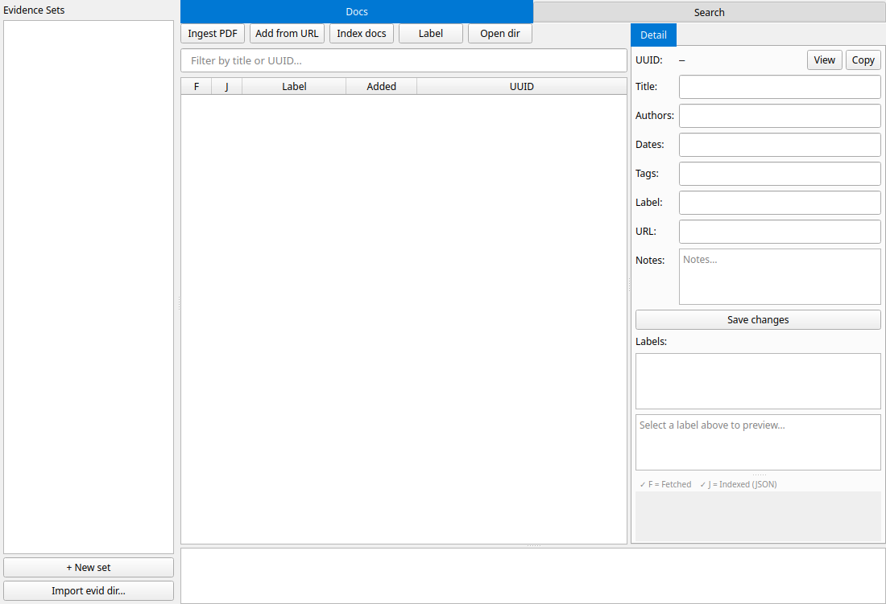
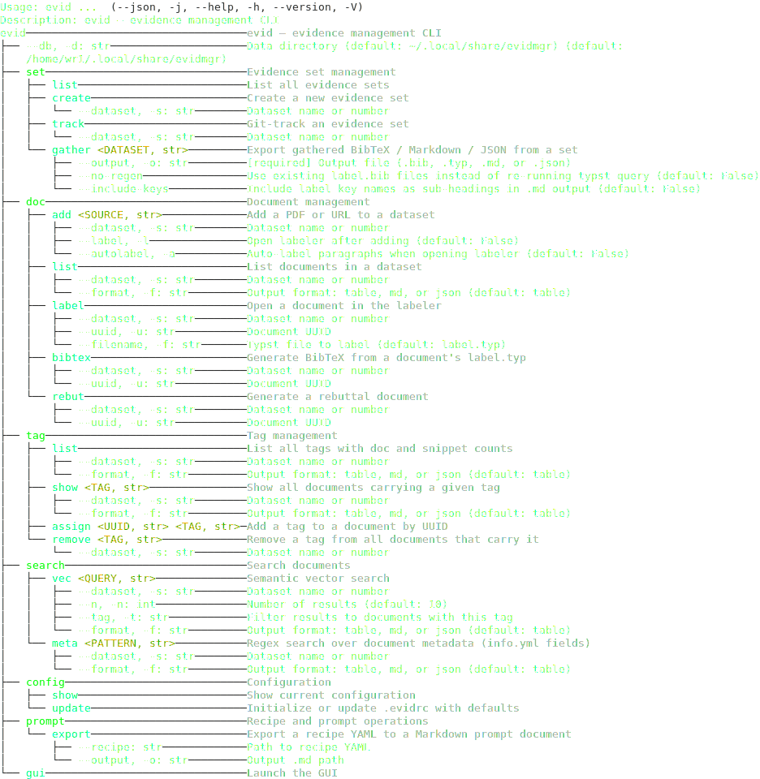

# evid — Evidence Manager

`evid` is a PDF evidence management tool for labelling, citing, and searching documents — primarily for legal and research workflows. It provides both a GUI and a full-featured CLI.

Agent-oriented usage: see **[`SKILL.md`](SKILL.md)** in this directory.



## Features

- Ingest PDFs or URLs; extract text and metadata automatically
- Label text snippets in a Typst editor with `#lab(key, text, note)` syntax
- Export labelled snippets to BibTeX for citation in LaTeX/Typst
- Semantic vector search across all ingested documents (multilingual embeddings; configurable model)
- Full-text body search — fuzzy (`rapidfuzz`) or regex — alongside metadata (regex) search
- MCP server (`evid mcp <set>`) — a warm, single-dataset query session for agents (avoids per-call model reload; no cross-set discovery)
- Regex metadata search over document fields
- Tag documents (synced across `info.yml` and a global `tags.yml` registry)
- Generate rebuttal documents from collected evidence

## Requirements

- Python 3.11+
- [`uv`](https://docs.astral.sh/uv/) (recommended) or pip
- [`typst`](https://typst.app) binary on `PATH` — required for label extraction
- PySide6 — installed automatically with the package (GUI only)

## Installation

```bash
uv pip install "evid @ git+https://github.com/evidlabel/evid.git"
```

## Data directory

Evidence sets and the tag registry live under a single **data directory**:

| Path | Purpose |
|------|---------|
| `{data_dir}/sets/<slug>/` | One evidence set (`set.yml`, `docs/`) |
| `{data_dir}/sets/<slug>/docs/<uuid>/` | One document (`info.yml`, `label.*`, PDF) |
| `{data_dir}/tags.yml` | Cross-set tag registry |

**Default:** `~/.local/share/evid`. If you still have data under `~/.local/share/evidmgr`, it is picked up automatically.

**Override:** `evid -d /path/to/store …` or set `data_dir` in `~/.local/share/evid/evid.yml` (used by the GUI).

**Embedding model:** vector search uses `embedding_model` from `evid.yml` (or the `EVID_EMBEDDING_MODEL` env var), default `intfloat/multilingual-e5-small`. After changing it, run `evid set reindex -s <set>` to rebuild each affected index.

Per-document sidecar metadata is `evid_meta.yml` (`indexed`, `notes`). Legacy `evidmgr_meta.yml` files are read and migrated on the next write.

## GUI

Running `evid` with no subcommand prints the CLI help. Launch the **Evidence
Manager** window explicitly:

```bash
evid gui
```

- **Sidebar** — evidence sets; select one to load it in the tabs.
- **Docs** — ingest, list, detail edit, labelling, tags.
- **Search** — meta (regex over `info.yml`) and vector (semantic) search.

**Docs table shortcuts**

- Drag across rows to select a range; Ctrl+click toggles; Shift+click extends.
- **Alt+drag** a row onto another set in the sidebar to copy the document.
- Ctrl+PageUp / Ctrl+PageDown switch between Docs and Search.

On startup, the first set in the sidebar is selected and loaded in Docs automatically.

## CLI



### Quick-start

```bash
# Create a dataset and add a document
evid set create my-research
evid doc add paper.pdf --dataset my-research

# Semantic search
evid search vec "children separated from parents" --dataset my-research

# Regex search over metadata
evid search meta "Guardian" --dataset my-research

# Export gathered BibTeX
evid set gather my-research -o refs.bib

# List and tag documents
evid doc list --dataset my-research --format md
evid tag assign <uuid> my-tag --dataset my-research
evid tag list
```

Tags are written to both the document’s `info.yml` and `{data_dir}/tags.yml`.

### Search

Vector search (`search vec`) embeds the query with a sentence-transformer model and returns the nearest chunks from the ChromaDB index. Results can be output as a rich table (default), Markdown, or JSON:

```bash
evid search vec "parental rights" --dataset litc --n 10 --format json
evid search meta "2024" --dataset litc --format md
```

### Labelling

1. `evid doc label --dataset <set> --uuid <uuid>` generates `label.typ` from the PDF and opens it in your configured editor (default: `code`).
2. Wrap text with `#lab("key", "highlighted text", "note")`.
   VS Code snippet binding for `Ctrl+L` in `.typ` files:
   ```json
   {
     "key": "ctrl+L",
     "command": "editor.action.insertSnippet",
     "when": "editorTextFocus && editorLangId == 'typst'",
     "args": {"snippet": "#lab(\"$1\",\"${TM_SELECTED_TEXT}\",\"$2\")"}
   }
   ```
3. On editor close, `label.json` and `label.bib` are generated automatically via `typst query`.
4. Collect all snippets across a dataset:
   ```bash
   evid set gather my-research -o refs.bib
   ```

### Configuration

```bash
evid config show    # show ~/.evidrc (editor and related CLI preferences)
evid config update  # write defaults to ~/.evidrc
```

`~/.evidrc` (YAML) — example:

```yaml
editor: code
default_dir: ~/Documents/evid   # legacy CLI preference field
```

The runtime data store for `evid set` / `evid doc` uses `EvidConfig.data_dir` (default `~/.local/share/evid`, with legacy `evidmgr` migration) unless you pass `-d` / `--db`.

GUI settings are also stored under `{data_dir}/evid.yml`.

## Development

```bash
uv run pytest -v
HEADLESS=1 uv run pytest -v   # includes GUI smoke tests
```
