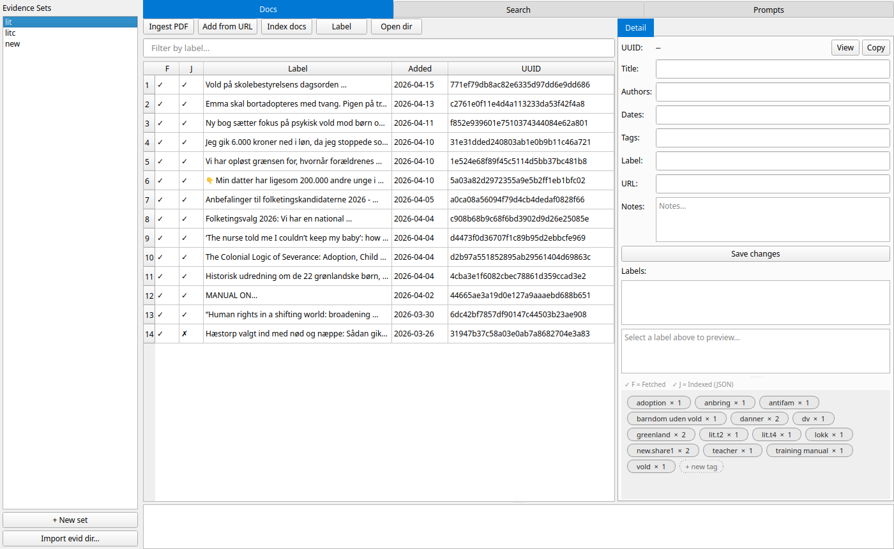
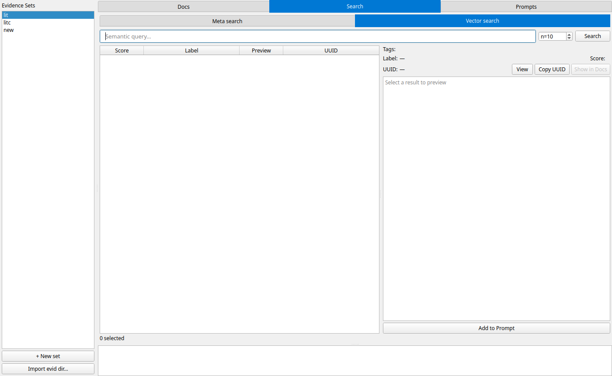

# evid — Evidence Manager

`evid` is a PDF evidence management tool for labelling, citing, and searching documents — primarily for legal and research workflows. It provides both a GUI and a full-featured CLI.

## Features

- Ingest PDFs or URLs; extract text and metadata automatically
- Label text snippets in a Typst editor with `#lab(key, text, note)` syntax
- Export labelled snippets to BibTeX for citation in LaTeX/Typst
- Semantic vector search across all ingested documents
- Regex metadata search over document fields
- Tag documents and filter by tag
- Generate rebuttal documents from collected evidence
- Anonymise documents (placeholder / fake entity substitution)

## Requirements

- Python 3.12+
- [`uv`](https://docs.astral.sh/uv/) (recommended) or pip
- [`typst`](https://typst.app) binary on `PATH` — required for label extraction
- PySide6 — installed automatically with the package (GUI only)

## Installation

```bash
uv pip install "evid @ git+https://github.com/evidlabel/evid.git"
```

## GUI

Launch the GUI (default when invoked with no arguments):

```bash
evid
```



## CLI


### Quick-start

```bash
# Create a dataset and add a document
evid set create my-research
evid doc add paper.pdf --dataset my-research

# Semantic search
evid search vec "children separated from parents" --dataset my-research

# Regex search over metadata
evid search meta "Guardian" --dataset my-research

# Export gathered BibTeX
evid set gather my-research -o refs.bib

# List and tag documents
evid doc list --dataset my-research --format md
evid tag assign <uuid> my-tag
evid tag list
```

### Search

Vector search (`search vec`) embeds the query with a sentence-transformer model and returns the nearest chunks from the ChromaDB index. Results can be output as a rich table (default), Markdown, or JSON:

```bash
evid search vec "parental rights" --dataset litc --n 10 --format json
evid search meta "2024" --dataset litc --format md
```

### Labelling

1. `evid doc label --dataset <set> --uuid <uuid>` generates `label.typ` from the PDF and opens it in your configured editor (default: `code`).
2. Wrap text with `#lab("key", "highlighted text", "note")`.
   VS Code snippet binding for `Ctrl+L` in `.typ` files:
   ```json
   {
     "key": "ctrl+L",
     "command": "editor.action.insertSnippet",
     "when": "editorTextFocus && editorLangId == 'typst'",
     "args": {"snippet": "#lab(\"$1\",\"${TM_SELECTED_TEXT}\",\"$2\")"}
   }
   ```
3. On editor close, `label.json` and `label.bib` are generated automatically via `typst query`.
4. Collect all snippets across a dataset:
   ```bash
   evid set gather my-research -o refs.bib
   ```

### Configuration

```bash
evid config show    # show current settings
evid config update  # write defaults to ~/.evidrc
```

`~/.evidrc` (YAML):
```yaml
default_dir: ~/Documents/evid
editor: code
```
