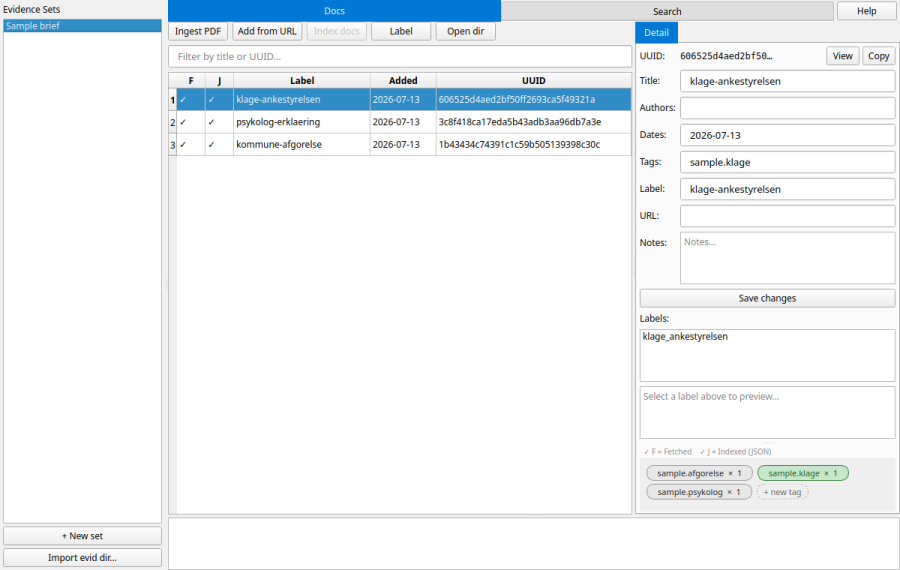
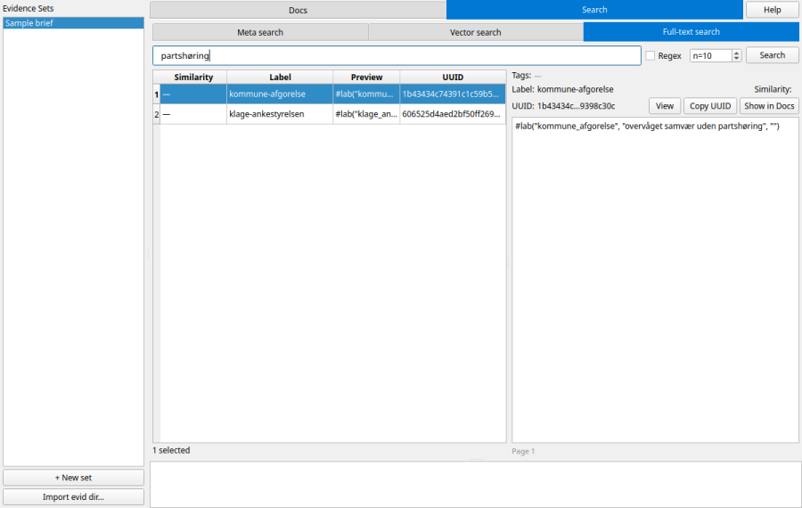

# evid

**Aim.** Human and agent collaboration on document sets for legal work: find, quote, and cite from the same store, without either side inventing wording.

**Use.** Ingest PDFs and URLs into an evidence set. Search (semantic, metadata, full text). Make spans citable — by hand in Typst (`#lab`) or by machine (`evid doc quote`). Gather BibTeX / Hayagriva / Markdown / JSON. Author the brief elsewhere (Typst / labquote), keys only.

**Features.**
- CLI + GUI over one on-disk layout (`sets/<slug>/docs/<uuid>/`)
- Manual labelling in `label.typ`; machine quoting into `machine.hayagriva` (verbatim match, never paraphrase)
- Vector, metadata, and body search; tags; gather for interchange
- MCP server (`evid mcp <set>`) for a warm agent query session

License: [MIT](LICENSE). CLI: `evid -h`. Agents: [`SKILL.md`](SKILL.md).

<table>
<tr>
<td align="center" width="50%"></td>
<td align="center" width="50%"></td>
</tr>
<tr>
<td align="center">Docs</td>
<td align="center">Search</td>
</tr>
</table>

## Install

Python 3.12+, [uv](https://docs.astral.sh/uv/), [`typst`](https://typst.app) on PATH.

```bash
uv tool install "evid @ git+https://github.com/evidlabel/evid.git"
```

Data dir defaults to `~/.local/share/evid`. For a deliverable, pass `-d ./evid` on every command.

```bash
evid gui
evid -d ./evid set create my-case
evid -d ./evid doc add paper.pdf -s my-case
```

## Development

```bash
uv sync
HEADLESS=1 uv run pytest -v
QT_QPA_PLATFORM=offscreen HEADLESS=1 uv run python scripts/gui_readme_shots.py
```

`pre-commit install` also installs a **pre-push** hook that regenerates `assets/gui-docs.png` and `assets/gui-search.png` and fails if they differ from git.
