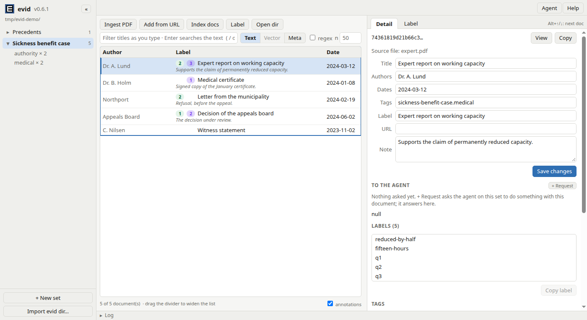
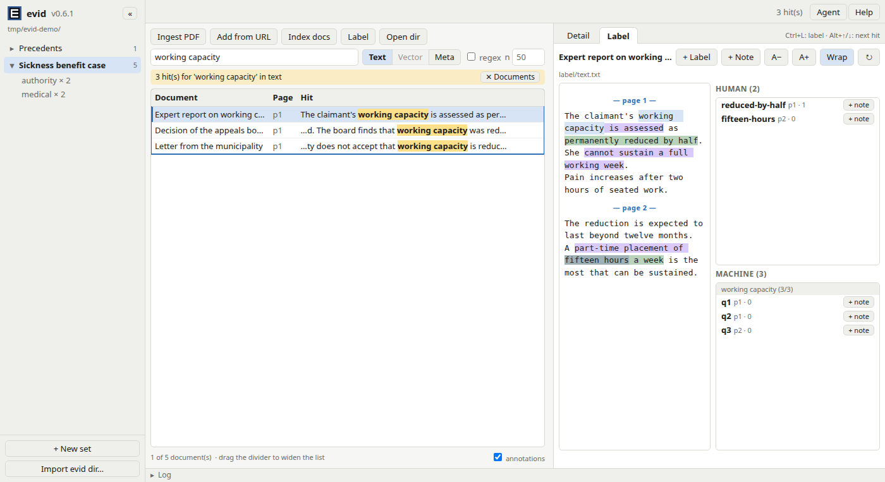

# evid

**Aim.** Human and agent collaboration on document sets for legal work: find, quote, and cite from the same store, without either side inventing wording.

**Use.** Ingest PDFs and URLs into an evidence set. Search (semantic, metadata, full text). Make spans citable — by hand (`evid label`, or in the GUI) or by a machine pass (`evid doc quote`). Gather BibTeX / Hayagriva / Markdown / JSON. Author the brief elsewhere (Typst / labquote), keys only.

**Features.**
- CLI + GUI over one on-disk layout (`sets/<slug>/docs/<uuid>/`)
- Precise quoting. `evid label add` and `evid doc quote` locate a passage in the document and store that span of `label/text.txt`. The cited words are the document's own.
- Passes. Each `evid doc quote` run is one job, recorded under `pass/` with its description, model, and match outcomes. Later runs add passes; `evid doc passes` lists the ledger.
- Human labels in `label/labels.json` are the same kind of span, with notes
- Vector, metadata, and body search; tags; gather for interchange
- MCP server (`evid mcp <set>`) for a warm agent query session

License: [MIT](LICENSE). CLI: `evid -h`. Agents: [`SKILL.md`](SKILL.md).

<table>
<tr>
<td align="center" width="50%"></td>
<td align="center" width="50%"></td>
</tr>
<tr>
<td align="center">Docs</td>
<td align="center">Search → label</td>
</tr>
</table>

The screenshots are a fictional case.

## Install

Python 3.12+, [uv](https://docs.astral.sh/uv/), [`typst`](https://typst.app) on PATH.

The default install is the CLI, the MCP server and the GUI (no embedding model):

```bash
uv tool install "evid @ git+https://github.com/evidlabel/evid.git"
```

Extras: `evid[vec]` (ChromaDB + sentence-transformers) for vector search; `evid[all]` is the same. For `evid[vec]` / `evid[all]` as a tool, pin a non-CUDA torch:

```bash
UV_TORCH_BACKEND=auto uv tool install "evid[vec] @ git+https://github.com/evidlabel/evid.git"
```

Data dir defaults to `~/.local/share/evid`. For a deliverable, pass `-d ./evid` on every command.

```bash
evid gui
evid -d ./evid set create my-case
evid -d ./evid doc add paper.pdf -s my-case
```

### GUI

`evid gui` serves the GUI on `127.0.0.1` (loopback only) and shows it in the `evid-app` window, or in your web browser when `evid-app` is not installed (`--browser` forces the browser). Closing the window quits. A second `evid gui` for the same data dir brings the running one forward.

`evid-app` is a small [Tauri](https://tauri.app) window in `app/`. To build it you need Rust and the WebKitGTK libraries (Debian/Ubuntu: `libwebkit2gtk-4.1-dev libgtk-3-dev libsoup-3.0-dev libjavascriptcoregtk-4.1-dev librsvg2-dev`):

```bash
cargo build --release --manifest-path app/Cargo.toml
install -m755 app/target/release/evid-app ~/.local/bin/   # or set EVID_APP=/path/to/evid-app
```

An editable checkout also finds `app/target/{release,debug}/evid-app` without installing it.

**Agent pane.** The *Agent* button (top right) opens terminals next to the documents, as in [treedit](https://github.com/wr1/treedit): a shell, or an agent with `evid gui --agent claude` (or `$EVID_AGENT`). An agent belongs to one evidence set: it starts in that set's folder, and `evid` there uses the GUI's data dir and that set by default (`$EVID_DB`, `$EVID_SET`), so `evid doc notes` just works. The pane shows the selected set's terminals; other sets' keep running, and the set tree marks sets with an agent attached. *Selection* types a reference to the selected documents, labels or label.typ text into the terminal. The terminal is served on loopback only and needs the page's token.

**Live.** While an agent (or the CLI, or an editor) changes a set — cleaning up titles, adding notes, labelling — the GUI follows along: changed rows get a fading ◆ marker, the open document's details take in the outside change without losing your unsaved edits (a field you both changed shows a banner: use the disk version or keep yours), the label editor merges outside edits into yours line by line, and reloads when `label/labels.json` or a pass changes outside.

## Development

```bash
uv sync --all-extras
uv run pytest -v
```

The GUI is `src/evid/web/`: `server.py` (standard-library HTTP + JSON API), `jobs.py` (background work and the event stream the page polls) and `page.html` (the whole frontend, vanilla JS). The page's pure helpers are tested in node (`tests/test_page_js.py`; skipped without `node`).

`pre-commit install` runs the pytest suite on each commit (`uv run --no-sync`).
